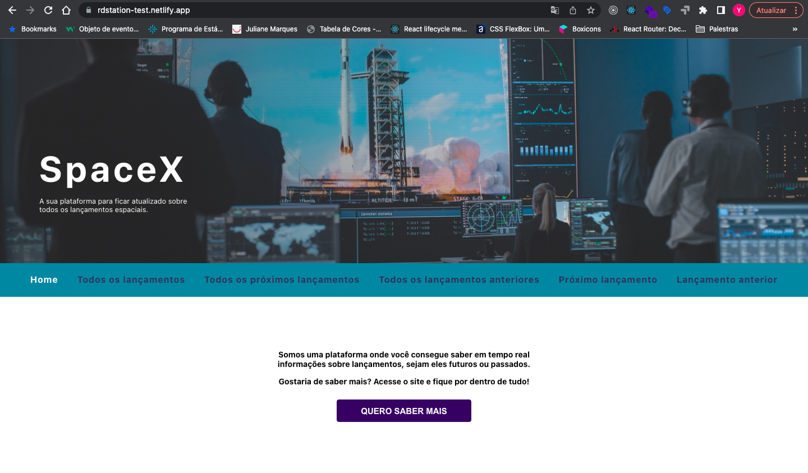
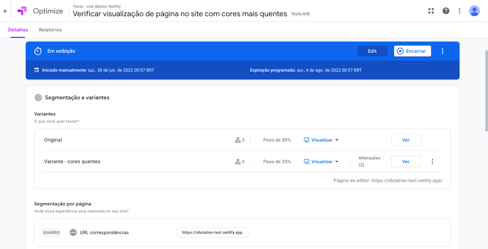
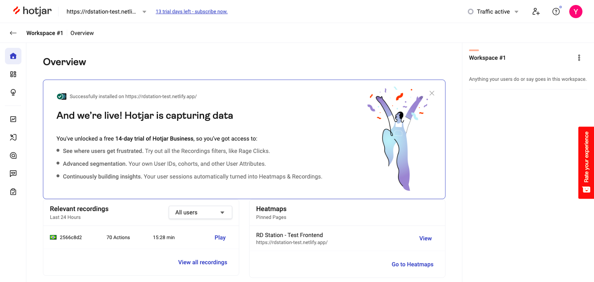
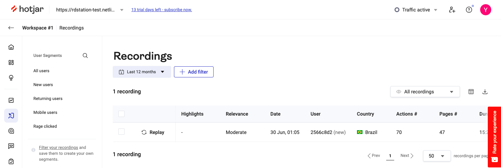
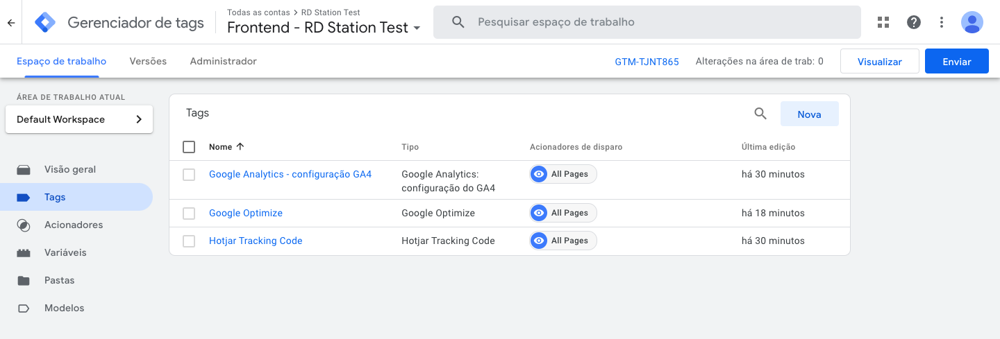
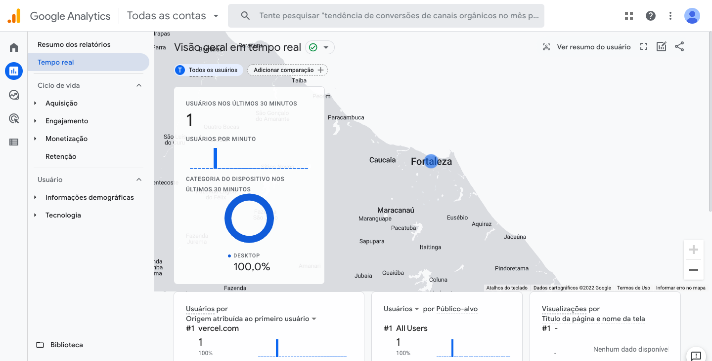

# RD Station Project

Projeto desenvolvido para processo seletivo na [RD Station](https://rdstation.com) para a vaga de **Engenheiro de Software FullStack | Growth Engineering**

## :bookmark_tabs: Sobre o projeto:

Criação de um frontend que irá se comunicar com a API também elaborada por mim, para apresentar informações sobre lançamentos. E para finalizar, deve-se criar um teste A/B simples (pode ser uma mudança de cor na página ou na variante A aparecer uma imagem e na variante B não aparecer) com a ferramenta Google Optimize (ou na que você se sentir mais confortável).

:globe_with_meridians: Demonstração [Aqui](https://rdstation-test.netlify.app/)

## :scroll: Regras do negócio:

O Desafio Técnico consiste em criar uma aplicação web que realiza o consumo de uma API elaborada com base na API da SpaceX, onde é possível ver os dados de lançamentos de foguetes.

Requerimentos técnicos:
- :white_check_mark: Mantenha o código no Github
- :white_check_mark: Criar um teste A/B com a ferramenta Google Optimize

Frontend:
- :white_check_mark: React
- :white_check_mark: Consumir a API

Extra:
- :white_check_mark: Integrar o script (snippet) do Hotjar no site criado
- :white_check_mark: Integração do Google Optimize, Hotjar e Google Analytics na página através do **Google Tag Manager**
- :white_check_mark: Fazer o deploy no Heroku ou similares (Fiz o meu deploy na Netlify)
- :white_check_mark: Implementação de testes unitários

## :open_book: Informações

#### :rocket: Execução

`npm start`
> Iniciar aplicação através do App.js.

`npm run dev`
> Para rodar o projeto localmente, nele antes é inicializado o server no arquivo app, e logo em seguida o servidor referente ao ambiente de desenvolvimento.

`npm run build`
> Compila o código em desenvolvimento para ser servido na pasta public

`npm install`
> Após ser feito o clone, para instalação correta de todas as dependências

#### 📓 Soluções adotadas e informações

Utilizei **React** para o desenvolvimento da aplicação web.

Utilizei **React Router** para o desenvolvimento das rotas que foram utilizadas para criar as pages no frontend.

Foi utilizado o **Google Optimize** para criação de teste A/B. Foram desenvolvidos os seguintes testes:

- Mudança do background dos principais itens da homepage, como **barra de navegação** e **botão** para cores mais quentes.
Adicionei uma proporção de 80% (para a página original) e 20% para a página B. Essa é a porcentagem em que ambas as páginas serão mostradas para as pessoas que visitarão o site. 

**Uma métrica possível de ser avaliada nesse caso é o tempo de permanência na página, em qual das duas variantes o usuário permanece por mais tempo. Se houvesse inscrição em alguma newsletter ou venda de serviços, poderíamos verificar a métrica de conversão e avaliar qual das variáveis teve a maior conversão.**

A aplicações consistem da tela inicial, onde criei uma `Homepage` simulando um site de informações sobre lançamentos de foguetes e naves espaciais. Todas as outras páginas mostram especificamente os dados de lançamento vistos de acordo com a escolha do usuário na barra de navegação. Essas páginas são alimentadas pela API que criei para esse projeto. Para o controle dessas rotas, utilizo o `react-router-dom`.

Adicionei também O **Hotjar** na página, que é uma ferramenta utilizada para criar registros do comportamento do visitante no seu site. Tendo o conhecimento desses dados, a empresa pode encontrar melhores oportunidades de interação no site.

**O Google Optimize, Hotjar e Google Analytics foram integrados na página por meio do assistente de Tags do Google: Google Tag Manager**.

Extensões utilizadas que auxiliam no desenvolvimento:

- Google Optimize: para avaliar se a página está integrada ao Google Optimize
- Tag Assistant: para verificar se a Tag está integrada de forma correta na página

Para visualização da performance do site é utilizado o [Lighthouse](https://developers.google.com/web/tools/lighthouse?hl=pt-br)

#### :gear: Tecnologias utilizadas

1. [React](https://pt-br.reactjs.org/): Utilizado React para criação da interface da aplicação web.
1. [Google Analytics](https://analytics.google.com): Com ele é possível monitorar o perfil de quem acessa seu site, páginas mais acessadas, conversões, dispositivos, cidades e outros dados.
2. [Google Optimize](https://optimize.google.com): Ferramenta de otimização gratuita que ajuda a testar se alterações no seu site podem melhorar o seu desempenho de vendas.
3. [SCSS](https://sass-lang.com/): Pré-processador de CSS utilizado para estilização de todo o projeto.
6. [react-router-dom](https://reactrouter.com/web/api/): Para gereciamento de rotas na aplicação.
7. [RTL](https://testing-library.com/docs/react-testing-library/intro/): Para criação de testes unitários na aplicação
8. [Hotjar](https://hotjar.com): Utilizado para criar registros do comportamento do visitante no seu site.
